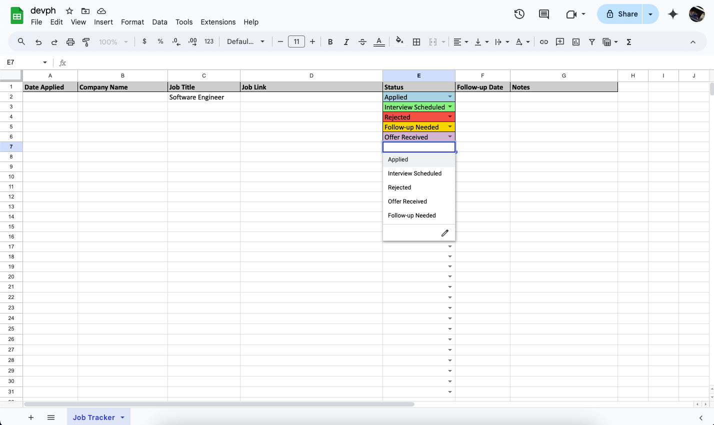

# 🏆 Job Application Tracker  

  

Looking for a job can be overwhelming, but staying organized can make a huge difference. This Job Application Tracker helps you:  

✅ Keep track of the jobs you've applied for  
✅ Monitor application statuses (Pending, Interview, Offer, Rejected)  
✅ Stay consistent with follow-ups  
✅ Analyze trends in your job search  

## 📌 Why is this helpful?  

- **Saves Time** – No more guessing which companies you’ve applied to.  
- **Better Organization** – Track deadlines, interview dates, and follow-ups in one place.  
- **Improves Strategy** – Identify which job applications perform best and adjust your approach.  
- **Boosts Motivation** – Seeing progress keeps you motivated throughout the job search.  

If you're struggling to find a job, message me on Instagram! 👉 [@carlcastanas](https://www.instagram.com/carlcastanas/)  
